## Django Job Portal

### Features

### HOME
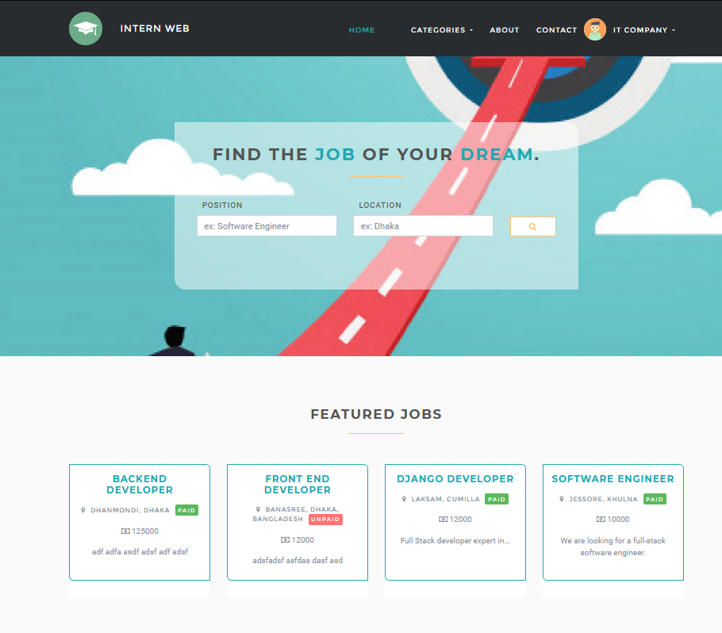

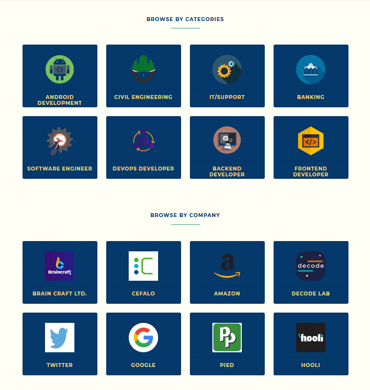

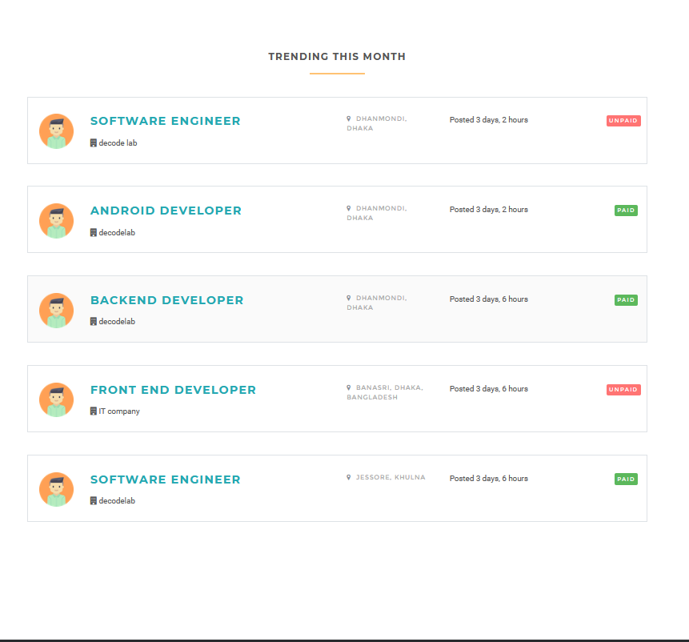

### NAVBAR

#### Categories
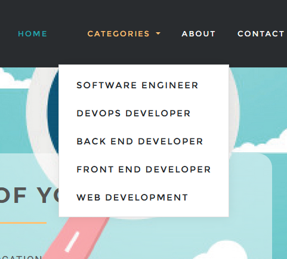

#### Multiple User                   Student Options
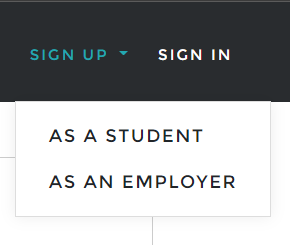 | 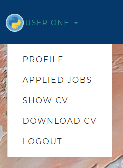

#### Employer Options                    Admin Options
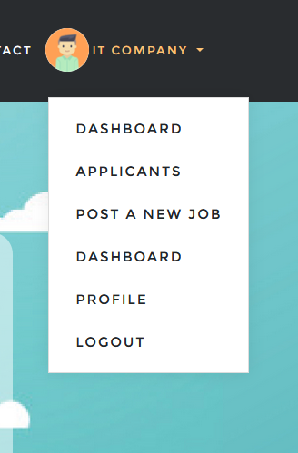 | 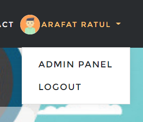

### PROFILES

#### Employer Profile
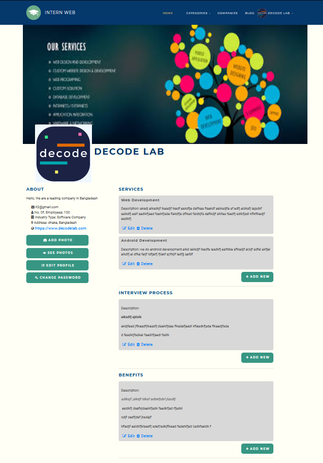

#### Student Profile
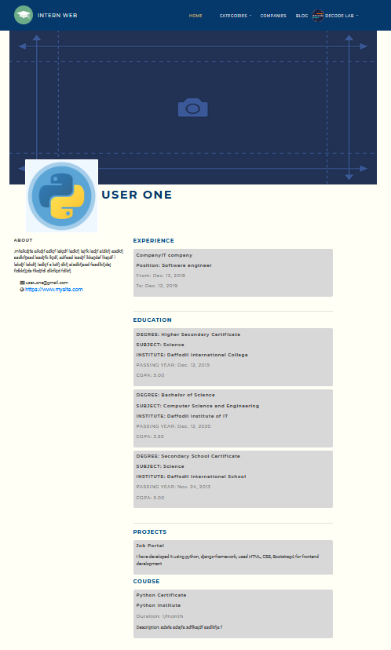

### Student RESUME SHOW & DOWNLOAD
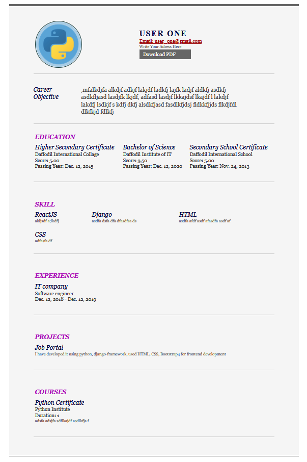

### SIGN UP

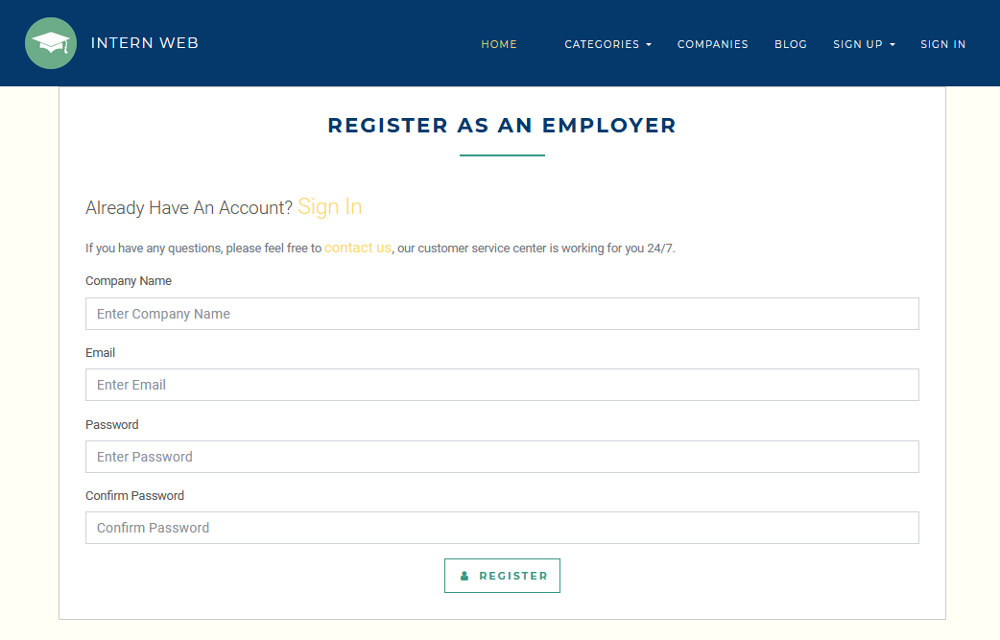

### JOBS
#### Apply For The Job Option Will Be Available Only If you are logged in & you are a student. 

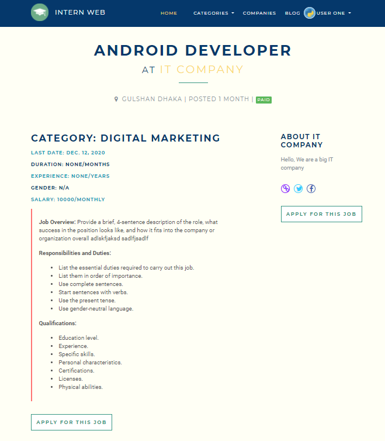

