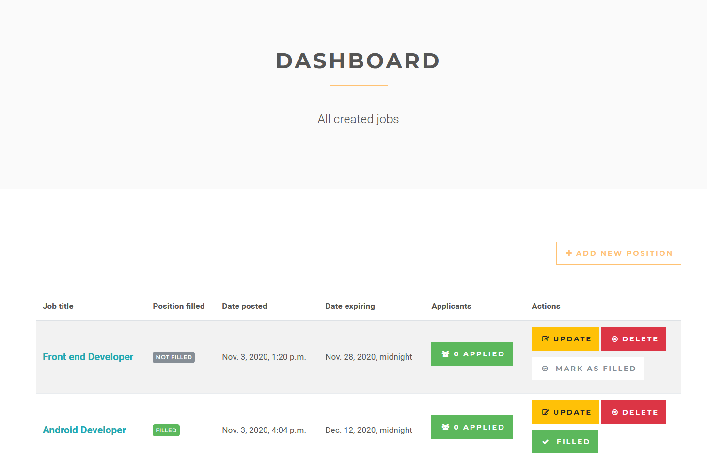
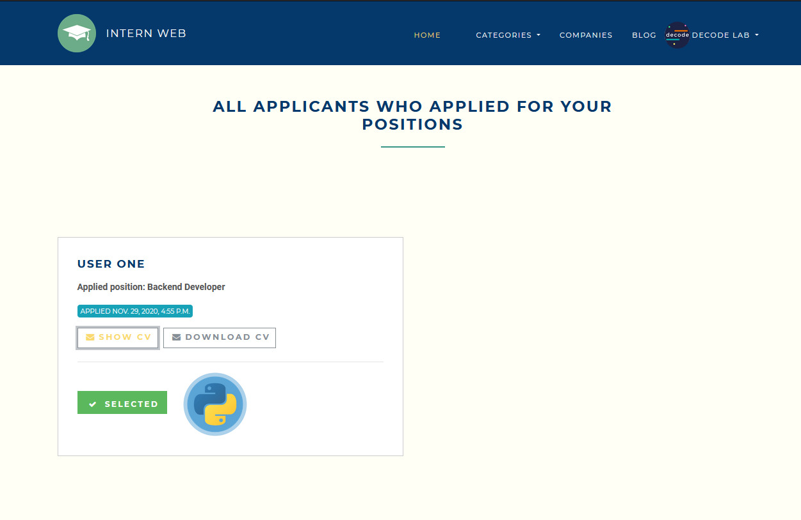
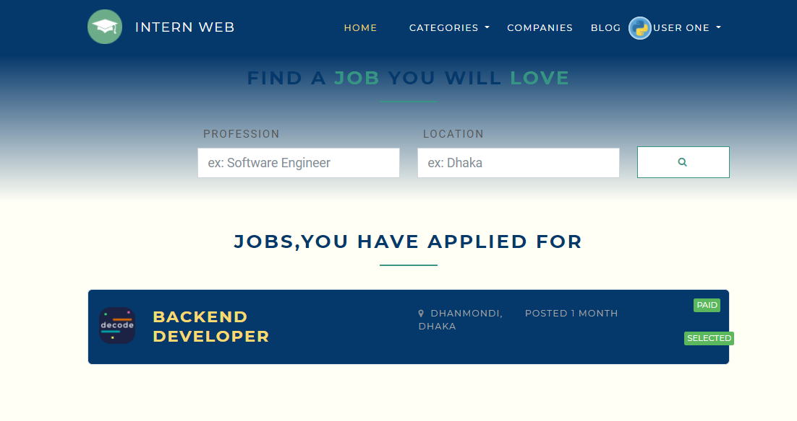
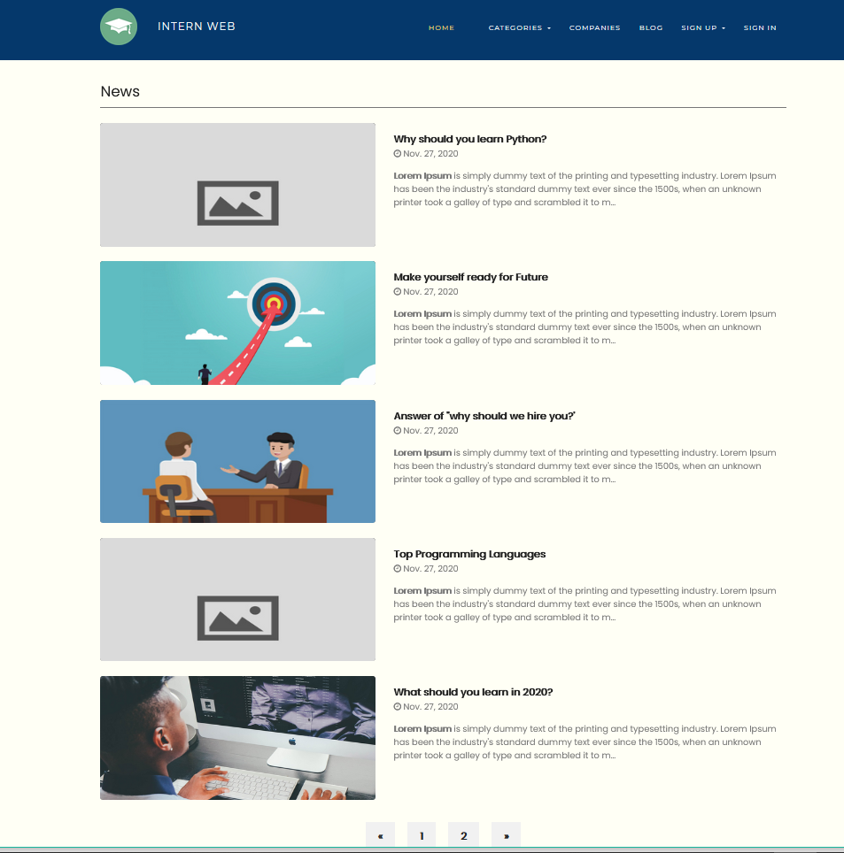
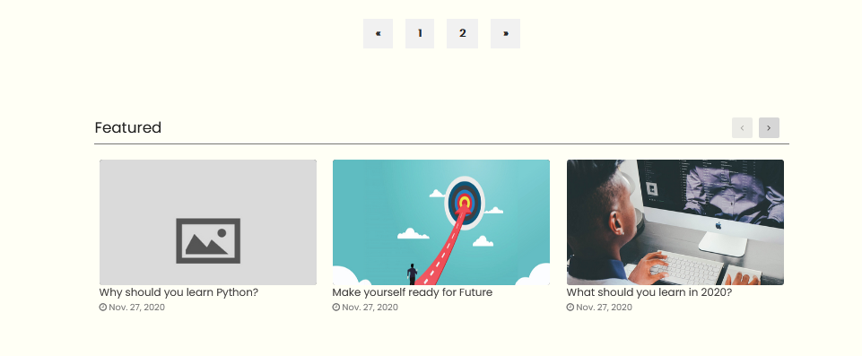

## Django Job Portal

### Features
1. Multiple User Sign Up
    * As A Student
    * As A Employer

2. Search By Place and Position
3. Company Profile
    * Basic Infromation Update
        * Profile Picture
        * Cover Picture
        * About Company
        * Website, 
        * Employee Number

    * Services - CRUD
    * Interview Process - CRUD
    * Benfits - CRUD
    * Company Images

4. Employee Profile
    * Basic Infromation Update
        * Profile Picture
        * Cover Picture
        * About 

    * Education - CRUD
    * Experience - CRUD
    * Projects - CRUD
    * Courses - CRUD
    * Automated CV from Profile Data
    * Download CV
    * Applied Jobs
    * Automated Job Deletion If Rejected

5. Trending Jobs Of This Month

6. Only If Authenticated User is "STUDENT" then s/he can apply
7. Job
    * Create
    * Update
    * Delete

8. Blog
    * Blog List
        * Featured & Non - Featured
    * Search

9. ALl Companies List

10. ALl Categories List 
    * Filtered Jobs According To Category 
    * Filterd Jobs According To Not - Filled

11. Dynamically Site Settings
    * Name
    * Logo
    * Contact Details
    * About

### HOME

### NAVBAR

#### Categories

#### Multiple User                   Admin Options
 | 

#### Employer Options                    Employee Options
 | 

### PROFILES

#### Employer Profile

#### Student Profile

### Student RESUME SHOW & DOWNLOAD

### SIGN UP

### JOBS
#### Apply For The Job Option Will Be Available Only If you are logged in & you are a student. 

### EMPLOYER DASH BOARD

#### All Aplicants

### Empoyee's Applied Jobs
#### Applied Jobs Will be deleted after a defined time(for example - 3 days) if the application is rejected by EMPLOYER

### BLOG
#### Blogs

#### Featured

